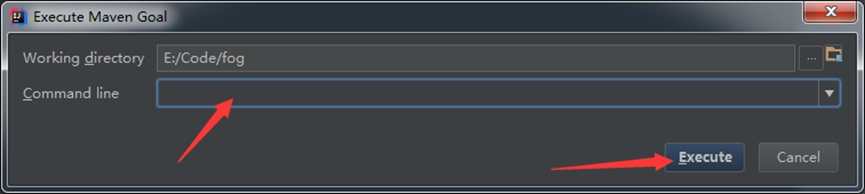

# EdgeWorkflow
One Click to Test and Deploy Your Workflow Applications to the Edge
# Developer
 * Developer organization:
 1. School of Computer Science and Technology, Anhui University, Hefei, China
 2. School of Information Technology, Deakin University, Geelong, Australia
 3. School of Software and Electrical Engineering, Swinburne University of Technology, Melbourne, Australia
 4. Faculty of Information Technology, Monash University, Melbourne, Australia

 * Developer Member: 
 * Xuejun Li, Ran Ding, Xiao Liu, Jia Xu, Yun Yang and John Grundy.
 
# EdgeWorkflow System Access Link

[EdgeWorkflow](http://47.98.222.243:8080/EdgeWorkflow)

[EdgeWorkflow (iseclab.org.cn)](http://www.iseclab.org.cn:8080/EdgeWorkflow)

# Installation

## IMPORTANT


1. `com.ccis.fog.IndexController` is the controller in which all HTTP requests can be found.

2. `com.ccis.fog.IndexService` is a collection of methods related to the operation of the algorithm.

3. `WEB-INF.jsp` file is the corresponding jsp information of all interfaces in the `WEB-INF` folder.

4. The configuration information in the `resources\application.properties` file is depicted as follows:

```properties
spring.mvc.view.prefix=/WEB-INF/jsp/
spring.mvc.view.suffix=.jsp
server.port=8080

server.jsp-servlet.init-parameters.development=true

#Email configuration
spring.mail.username=xxxxxxxxx@qq.com     //email
spring.mail.password=xxxxxxxxxxxxxxxx     //SMTP authentication code
spring.mail.host=smtp.qq.com
spring.mail.port=587
#spring.mail.properties.mail.stmp.ssl.enable=true
#Authentication mode
spring.mail.properties.mail.smtp.auth=true
#Extensions to plain text communication protocols. It provides a way to upgrade a plain text connection to an encrypted connection (TLS or SSL) rather than using a separate port for encrypted communication.
spring.mail.properties.mail.smtp.starttls.enable=true
spring.mail.properties.mail.smtp.starttls.required=true
#Enable TSL encryption (this configuration is not required for port 25, change TSL to SSL for port 465)
spring.mail.properties.mail.smtp.tsl.enable=true


#########################################
####Related configurations in Windows####
#########################################
#Science Workflow file folder
sim.xml_path=E:\\sim\\dax\\
dagXmlPath=E:\\dagXML\\
activitiXmlPath=E:\\activitiXML\\
storagePath=E:\\sim\\
#MySQL database connection information
spring.datasource.url=jdbc:mysql://127.0.0.1:3306/fogworkflowsim? //Database host address, port, and database name
characterEncoding=utf8&useSSL=false
spring.datasource.username=****                   //Database user name
spring.datasource.password=****                   //Database password
spring.datasource.driver-class-name=com.mysql.jdbc.Driver
##Host information required to execute Docker   //Docker host address, port, username, password
dockerlink.host=127.0.0.1
dockerlink.port=22
dockerlink.user=dr
dockerlink.password=********


#Static file request matching
spring.mvc.static-path-pattern=/**
#Modify the default statically addressed resource directory to use commas to separate multiple directories
spring.resources.static-locations = classpath:/META-INF/resources/,classpath:/resources/,classpath:/static/,classpath:/public/,file:F://file//
```

`Static` is a collection of `JAVASCRIPT` and `CSS` file used. `Echarts` is used for drawing diagrams, `layui` is used for pop-ups, and `XML` is used for workflow files.

6. Most of the front-end and back-end data is transmitted through `FastJSON`

7. Most of the front-end and back-end request interactions use `Ajax`

8. The EdgeWorkflow system uses `Maven` to manage dependency packages. Therefore, when users find package missing errors while deploying a project, they need to import the missing dependency packages into the project. All the `JAR` dependency packages required by the project are in the `lib` folder. User can use the following command to import the missing packages.

~~~java
mvn install:install-file 
 -Dfile=E:\lib\plottest.jar
 -DgroupId=plottest
 -DartifactId=plottest
 -Dversion=0.0.1
 -Dpackaging=jar
~~~

The details of importing jar packages are as follows




9. Importing the database

~~~mysql
source ***.sql
~~~

### How to run EdgeWorkflow ?

* Create a Java project in Eclipse.
* Inside the project directory, initialize an empty Git repository with the following command
* we provide a Web UI so that users can access EdgeWorkflow remotely and run their created edge workflow applications on our provided computing infrastructure. Web URL: http://47.98.222.243:8080/EdgeWorkflow
Start the service:

~~~java
jar -jar xxx.jar
~~~

We often use the `nohup command &` command form to launch background programs such as **Java services**

~~~java
 nohup java -jar xxxx.jar &
~~~

+++

# Introduction

## The main interface


* Area1: Show the workflow execution plan developed by the user.
* Area2: The execution result of workflow task time, cost and energy consumption in the execution scheme is displayed intuitively in the form of statistical graph.
* Area3: The workflow structure is presented as a DAG diagram.
* Area4: Monitor the execution results of workflow tasks in real time in tabular form, and display the execution details of each task.

## Adding an Execution Plan

**Figure 1**


* **Figure 1--**Step1: Select the workflow.
  * Set the name of the work execution scheme. (Necessary Steps)
  * Choose one of the following steps:
  * Step1-1: Select a workflow from the standard workflow library.**For workflow details, visit:**[Documentation – Pegasus WMS (isi.edu)](https://pegasus.isi.edu/workflow_gallery/)
  * Step1-2: Select custom workflow. The steps for custom workflow are shown in **Figure 2** below.
* **Figure 1--**Step2: Workflow task binding（Default mode is Standard Mode，You can switch the Binding Mode using Task Binding Mode）.
  * Standard model
  * Custom mode
* **Figure 1--**Step3: Set the number of hosts and performance parameters for the edge computing environment.
* **Figure 1--**Step4: Select offloading policy and scheduling algorithm
  * Selecting Offloading Policy: Energy-Optimal、All-in-Cloud、All-in-Edge.
  * Select Scheduling Algorithm:  **The scheduling algorithm is described later.** 
  * Optimization objective: Time, Cost, Energy.
  * Deadline:  Set the **maximum completion time** for each workflow task.

## Custom workflow

**Figure 2**


**Users who have registered and logged in**，In **Figure 1--step1**, if the Workflow provided by the standard Workflow library does not meet the use requirements, click **Draw Workflow** to jump to the DAG panel that manages your own Workflow, as shown in **Figure 2--step2**. Draw the panel as shown in **Figure 2--step3**. The Start node must be **Start Event**, the task node in the DAG diagram must be **Workflow task**, and the **End Event** is the End node. Parameters such as **ID and Name Workload** of  **node** and **edge** need to be set. After drawing, name the workflow in **Figure 2--step4**, save and exit, jump back to **Figure 2--step2**. Click the **Submit** button on each DAG diagram to generate a workflow file in XML file format.

## Workflow Task Binding


Workflow task binding mode is divided into **Standard Mode** and **Custom Mode**.

* Standard mode

  Switch to **Standard Mode** through Task Binding Mode, select the unassigned workflow Task on the left, move it to the corresponding algorithm on the right, and bind to it. **All tasks must be assigned before the next step**. The system provides four real computing tasks, which are described as follows:

  * **RandomPI Algorithm**:  Math.random() is used in conjunction with the Monte Carlo method to calculate the Pi value. Please refer to the:  [Estimating the value of Pi using Monte Carlo](https://www.geeksforgeeks.org/estimating-value-pi-using-monte-carlo/)
  * **KMP Match Algorithm**: The Knuth–Morris–Pratt string-searching algorithm (or KMP algorithm) searches for occurrences of a "word" W within a main "text string" S by employing the observation that when a mismatch occurs, the word itself embodies sufficient information to determine where the next match could begin, thus bypassing re-examination of previously matched characters. Please refer to the: [KMP Algorithm for Pattern Searching](https://www.geeksforgeeks.org/kmp-algorithm-for-pattern-searching/)
  * **Levenshtein Algorithm**: The Levenshtein distance also called the Edit distance, is the minimum number of operations required to transform one string to another. Editing operations include replacing one character with another, inserting a character, and deleting a character. In general, the smaller the edit distance, the greater the similarity of the two strings. Please refer to the: [Java Program to Implement Levenshtein Distance Computing Algorithm](https://www.geeksforgeeks.org/java-program-to-implement-levenshtein-distance-computing-algorithm/?ref=gcse)
  * **SelectSort Algorithm**: Selection sort is an in-place comparison sorting algorithm. It has an O(n^2) time complexity, which makes it inefficient on large lists, and generally performs worse than the similar insertion sort. Selection sort is noted for its simplicity and has performance advantages over more complicated algorithms in certain situations, particularly where auxiliary memory is limited. Please refer to the: [Selection Sort](https://www.geeksforgeeks.org/selection-sort/)

* Custom Mode

  Use `Task Binding Mode` switch to **Custom Mode**, and then click **each ** workflow task in the DAG diagram to code it. **Note:** In the DAG graph, for a computational task with parent-child relationship, this task needs to receive input parameters from the precursor node and output parameters to the successor node. This computation task only processes the input data, and the properties and number of its received and output parameters cannot be changed. Otherwise, it will affect the normal operation of the workflow computation task.

# Resource Management Algorithm
We introduce the details of the task offloading and scheduling algorithms supported in EdgeWorkflow currently. In the edge computing environment, given the three different layers of resources, viz. end device layer, Edge server layer and cloud server layer, a task offloading strategy is required first to determine which level or levels of resources will be used for task computation, before the task scheduling algorithm determines the order of tasks running on the allocated resources. (PDF link: https://github.com/ISEC-AHU/EdgeWorkflow/blob/156ca0a71313bdf19490fce6356e525e8c986f84/The%20Details%20of%20Offloading%20and%20Scheduling%20Algorithms.pdf).


## GA 

GA: Genetic algorithm (GA), also known as genetic evolutionary algorithm, mimics the process of natural selection in biological evolution theory and biological evolution in genetics. GA algorithm is usually used to solve the optimal solution of complex problems, which is mainly aimed at the initial population composed of a group of particles using binary coding, and each particle can be regarded as a possible solution of the problem. In the early stage of the algorithm, individuals are screened from all the current particles according to the size of the particle fitness, and then the next generation is generated by the operation of genetic factor crossover and mutation. This is repeated until the maximum number of runs is reached or the desired stop condition is met. The advantages of genetic algorithm are obvious:  excellent global detection performance, robustness and randomness of cross mutation. Similarly, the disadvantages of genetic algorithm are also obvious:  the convergence speed is slow, the feedback information in the environment cannot be used efficiently, and the redundant information in the environment cannot be processed in time.

The implementation process of genetic algorithm is actually like the evolution process in nature. Firstly, a "digital" coding scheme for the potential solution of the problem is sought, and the mapping relationship between phenotype and genotype is established. Then a population is initialized with random numbers, and the individuals in the population are these digital codes. Next, after an appropriate decoding process, each individual gene was assessed for fitness using an fitness function. Use a selection function to make a choice according to some criterion. Mutate individual genes. And then you have offspring. Genetic algorithms do not guarantee that you will get the optimal solution to a problem, but the great advantage of using genetic algorithms is that you do not have to know or worry about "finding" the optimal solution. It's as simple as "negating" some bad individuals. GA algorithm is described as follows: 


Algorithm is introduced in detail, please reference: [Genetic Algorithms](https://www.geeksforgeeks.org/genetic-algorithms/)


## PSO 

PSO: Particle Swarm optimization (PSO), originally proposed by Kenndy and Eberhart, is a computational model that mimics the foraging behavior of flocks of birds. The researchers noted that flocks of birds exhibit unexpected behavior in flight that cannot be predicted, such as sudden dispersal, convergence or change of direction. But at the macro level, the flock's behavior shows surprising synchronicity, meaning that individuals maintain a reasonable distance from each other, are less likely to collide, and the flock stays in the habitat. This is because there is an information-sharing mechanism among birds. Any particle in the PSO algorithm maps the feasible solution of a search domain, and the population can be understood as a set of feasible solutions. The initial population is randomly generated, and the position of each particle in the population is constantly changing as the behavior of the foraging birds is simulated. Each particle records its best position on its journey and learns from the best position in the history of the population. It is through self-learning and mutual cooperation that populations move closer to the optimal solution. As a kind of bionic heuristic intelligent algorithm, the advantages of particle swarm optimization algorithm are obvious, simple model, convenient operation, strong robustness, easy to implement and has profound intelligent characteristics. Similarly, particle swarm optimization algorithm also has some shortcomings, such as easy to fall into the local optimal solution, diversity loss too fast, the accuracy of parameters is not easy to determine.

Three simple rules of behavior in PSO algorithm:  ① Conflict avoidance:  the group moves in a certain space, individuals have their own will to move, but can not affect the movement of other individuals, avoid collisions and disputes.② Speed matching:  the individual must match the moving speed of the center, regardless of direction, distance and speed must cooperate with each other.③ Group center:  the individual will move to the group center and move to the target with the group center.

Algorithm is introduced in detail, please reference: [Particle Swarm Optimization (PSO) – An Overview](https://www.geeksforgeeks.org/particle-swarm-optimization-pso-an-overview/?ref=gcse)


## MinMin

MinMin:  MinMin algorithm is a simple algorithm with fast execution time. The idea of the algorithm is to map small tasks first and then to machines that perform fast.

The execution process is as follows:  calculate the expected completion time of each task to participate in the mapping event on each machine, find the earliest completion time of each task and its corresponding machine; Identify the task with the smallest earliest completion time and assign the task to the machine that acquired it; After the assignment is complete, update the machine's expected ready time and remove the completed mapped tasks from the task set. Repeat the process until all tasks are mapped.


## MaxMin

MaxMin:  MaxMin algorithm is very similar to the MinMin algorithm. The earliest completion time of each task on any available machine is also calculated. The difference is that MaxMin algorithm first schedules large tasks, and the task-to-resource mapping is to select the task with the earliest completion time and map it to the corresponding machine.


## FCFS

FCFS:  First come, first served (FCFS) scheduling algorithm is the simplest scheduling algorithm, which can be used for both job scheduling and process scheduling. FCFS algorithm is used to select one or more jobs from the backup queue at a time, call them into memory, allocate resources to them, create processes, and then put them into the ready queue. When FCFS algorithm is used in process scheduling, each schedule selects a process that first enters the queue from the ready queue, allocates processors to it, and puts it into operation. The process does not abandon the processor until it is finished or blocked by an event.

## RoundRobin

RoundRobin:  the principle of the RoundRobin scheduling algorithm is to allocate the execution requests from the task to the internal server in turn, starting from 1 to N(the number of internal servers), and then start the cycle again. The advantage of the algorithm is its simplicity, it does not need to record the state of all the current connections, so it is a stateless scheduling. Suppose there is a group of N servers, S = {S1, S2... Sn}, an indicator variable I represents the last selected server ID. The variable I is initialized to N minus 1.


# Supported Scientific Workflow

The EdgeWorkflow system support various kinds of standard scientific workflow and user's customized workflow. The standard scientific workflow includes Montage, CyberShake, Epigenomics, Inspiral, Sipht.

## Montage

The Montage application created by NASA/IPAC stitches together multiple input images to create custom mosaics of the sky.


## CyberShake

The CyberShake workflow is used by the Southern Calfornia Earthquake Center to characterize earthquake hazards in a region.


## Epigenomics

The epigenomics workflow created by the USC Epigenome Center and the Pegasus Team is used to automate various operations in genome sequence processing.


## LIGO Inspiral Analysis

LIGO's Inspiral Analysis workflow is used to generate and analyze gravitational waveforms from data collected during the coalescing of compact binary systems.


## Sipht

Harvard University's bioinformatics project is hunting for small untranslated Rnas (sRNAs) that regulate processes such as bacterial secretion and toxicity. The sRNA identification protocol program using High Throughput Technology (SIPHT) uses a workflow to automatically search for sRNA coding genes of all bacterial replicons in the National Center for Biotechnology Information (NCBI) database.


